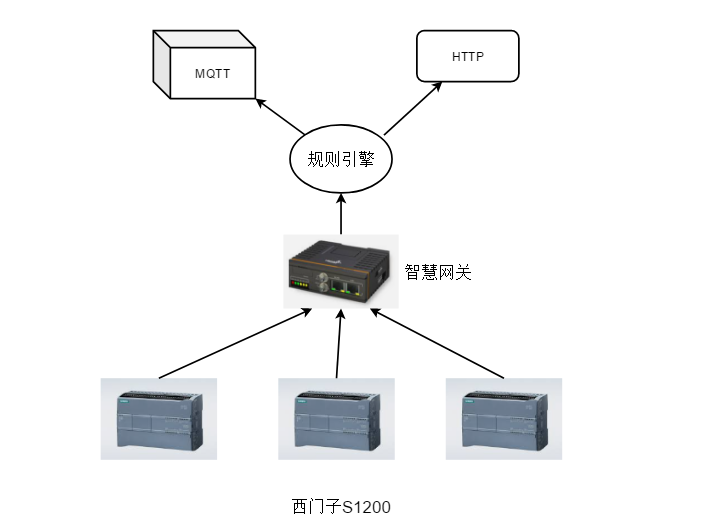

# 西门子操作网关

## 简介

这是一个用来操作PLC的网关，主要是用来做PLC的上位机



## 功能

1. 动态增删配置PLC读写参数
2. 数据透传到MQTT服务器
3. 数据透传到HTTP服务器
4. 下发PLC升级程序
5. 支持规则引擎
6. 支持S7协议的TCP和RTU模式

## 编译

```
CGO_ENABLED=1 GOARM=7 GOOS=linux GOARCH=arm CC=arm-linux-gnueabi-gcc go build -ldflags "-s -w -linkmode external -extldflags -static"
```

## 上传

```
scp ./smart-gateway root@192.168.1.101:/root/
```
